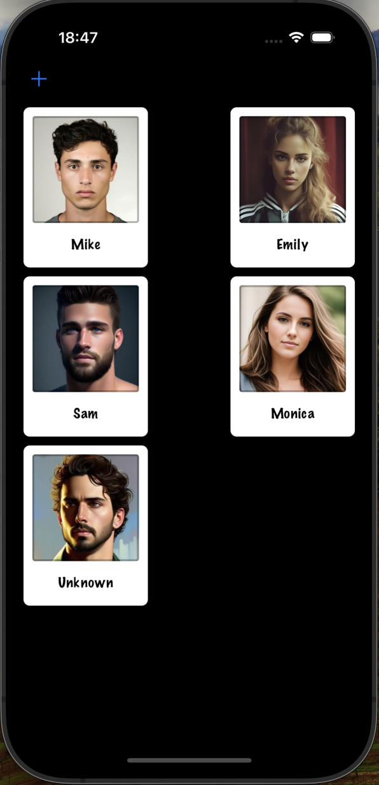
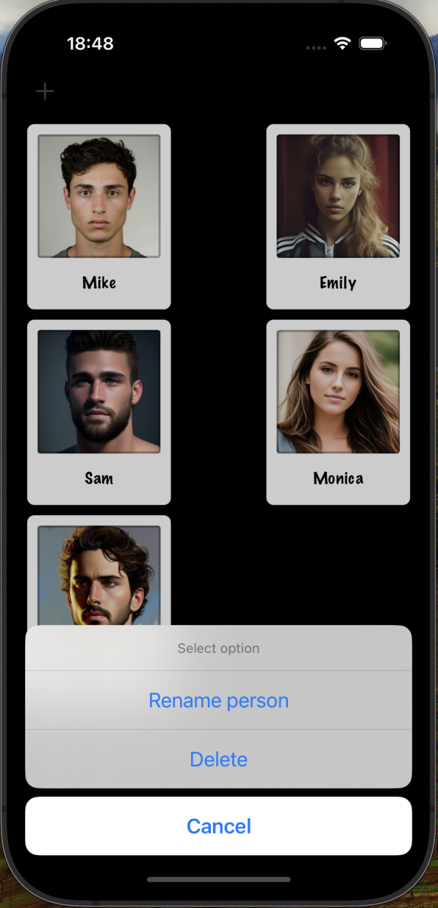

# Project12 UserDefaults

Project12 is an iOS app that allows users to add and view a collection of people with their names and images. Users can also rename or delete a person from the collection. Added functionality - saving people data in UserDefaults.

## Table of Contents

* [Features](#features)
* [Screenshots](#screenshots)
* [Requirements](#requirements)
* [Usage](#usage)
* [Code Overview](#code-overview)

## Features

* Add new people with names and images
* View a collection of people with their names and images
* Rename a person's name
* Delete a person from the collection
* Utilize camera for adding new person with image

## Screenshots

  
   
  <em>Person List Screen</em>

  
   
  <em>Edit Person Screen</em>

## Requirements

* iOS 12.0+
* Xcode 12.0+
* Swift 5.0+

## Usage

1. Launch the app.
2. Add a new person by tapping the add button.
3. Take a photo or select an existing one for the person.
4. Edit the person's name or delete the person from the collection by tapping on them.

## Code Overview

### ViewController

* Manages the collection of people and displays them in a collection view.
* Handles user interactions, such as adding, renaming, and deleting people.
* Utilizes UIImagePickerController for capturing images and updating image view.

### Person

* Represents a person entity with a name and an image.

### PersonCell

* Represents a custom UICollectionViewCell for displaying person's information with image and name.

## Possible Improvements

* Implement sorting options for the people's list based on name or image.
* Enhance UI design with animations for adding, renaming, and deleting people.
* Add search functionality to filter people by name.
* Provide options for sharing person's information or images with others. 

Feel free to explore the app and interact with the collection of people!
